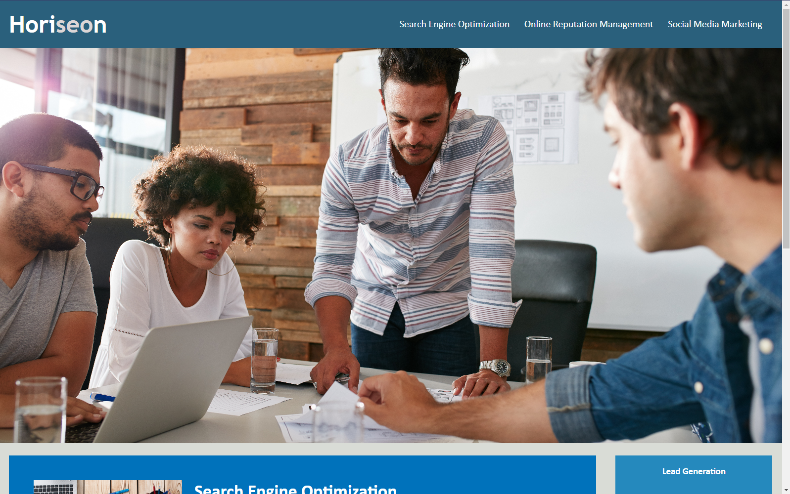

# Challenge 01

## Purpose of the Application

The purpose of the application is a website to explain what the 'Horiseon' company does. 

The purpose of the assignment was to familiarize ourselves with different HTML elements, including semantics. We also learned to streamline our stylesheet by combining similar rules. It was assigned in order to make us more comfortable with the main components of both HTML and CSS.

## Deployed Link

Live link:  https://aumcintyre.github.io/Homework-1/

Repo link: https://github.com/aumcintyre/Homework-1


## Screenshot



## My Experience

I started off by opening the HTML index and scanned through it for generic element tags like "div". I replaced each section with a semantic element tag, inluding header, nav, main, aside, and footer. After changing these tags, I went into the stylesheet and made the appropriate changes to the rules so they matched up with their new section names. 

Once each section was more specific, I checked to make sure all parts were in a logical order. From there I added an alt text to each of the 3 images within the "main" portion of my index. From there, I edited the header. I made the title of the website more specific and I added in a favicon for additional style. 

## Credit

Everything I used that we didn't take directly from the class came from w3schools

## Acceptance Criteria

```
GIVEN a webpage meets accessibility standards
WHEN I view the source code
THEN I find semantic HTML elements
WHEN I view the structure of the HTML elements
THEN I find that the elements follow a logical structure independent of styling and positioning
WHEN I view the icon and image elements
THEN I find accessible alt attributes
WHEN I view the heading attributes
THEN they fall in sequential order
WHEN I view the title element
THEN I find a concise, descriptive title
```
